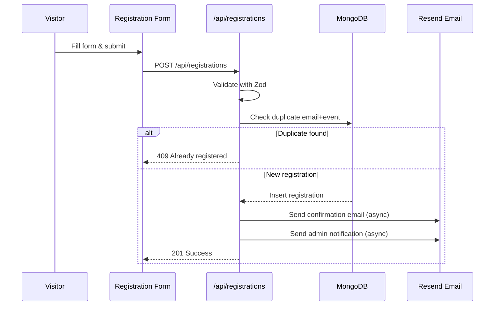
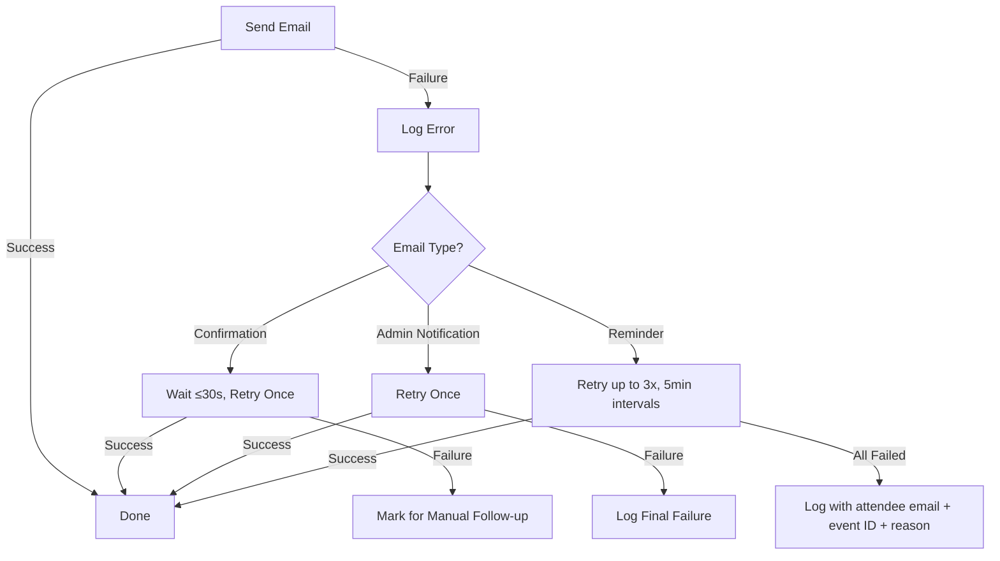

# Design Document: Event Registration

## Overview

The Event Registration feature adds a complete event lifecycle management system to the spanish-conveyancing website. It enables admins to create and publish events (webinars, seminars, workshops), allows visitors to register via public landing pages, and handles automated email communications (confirmations, admin notifications, reminders) through the existing Resend integration.

The system follows the existing project patterns: MongoDB for persistence, Zod for validation, Resend for transactional email, NextAuth for admin authentication, and Next.js App Router conventions (route groups, API routes, server components).

### Key Design Decisions

1. **MongoDB collections** for events and registrations (consistent with existing `leads` collection pattern)
2. **API routes** at `src/app/api/events/` and `src/app/api/registrations/` for backend logic
3. **Public event pages** under the `(marketing)` route group at `/events/[slug]`
4. **Admin pages** under `/dashboard/events/` (protected by existing middleware)
5. **Vercel Cron Jobs** for the reminder scheduler (fits the Next.js deployment model without additional infrastructure)
6. **Slug-based URLs** for public event pages (SEO-friendly, human-readable)

## Architecture

```mermaid
graph TB
    subgraph Public ["Public (marketing)"]
        EP[Event Landing Page<br/>/events/[slug]]
        RF[Registration Form]
    end

    subgraph Admin ["Admin (dashboard)"]
        EL[Events List<br/>/dashboard/events]
        EC[Event Create/Edit<br/>/dashboard/events/new<br/>/dashboard/events/[id]/edit]
        RL[Registrations List<br/>/dashboard/events/[id]/registrations]
    end

    subgraph API ["API Routes"]
        AE[/api/events]
        AR[/api/registrations]
        AC[/api/cron/reminders]
    end

    subgraph Services ["Services"]
        ES[Email Service<br/>Resend]
        DB[(MongoDB)]
        RS[Reminder Scheduler<br/>Vercel Cron]
    end

    EP --> AE
    RF --> AR
    EL --> AE
    EC --> AE
    RL --> AR

    AE --> DB
    AR --> DB
    AR --> ES
    AC --> DB
    AC --> ES
    RS --> AC
```

### Request Flow: Registration Submission



## Components and Interfaces

### Public Components

| Component | Location | Purpose |
|-----------|----------|---------|
| `EventPage` | `src/app/(marketing)/events/[slug]/page.tsx` | Server component — fetches event data, renders details + form |
| `RegistrationForm` | `src/components/events/RegistrationForm.tsx` | Client component — react-hook-form + zod validation |
| `EventClosedBanner` | `src/components/events/EventClosedBanner.tsx` | Displays "registration closed" message for past events |

### Admin Components

| Component | Location | Purpose |
|-----------|----------|---------|
| `EventsListPage` | `src/app/dashboard/events/page.tsx` | Lists all events with status, date, registration count |
| `EventFormPage` | `src/app/dashboard/events/new/page.tsx` | Create new event form |
| `EventEditPage` | `src/app/dashboard/events/[id]/edit/page.tsx` | Edit existing event form |
| `EventRegistrationsPage` | `src/app/dashboard/events/[id]/registrations/page.tsx` | View/manage registrations for an event |
| `EventForm` | `src/components/admin/EventForm.tsx` | Shared form component for create/edit |
| `RegistrationTable` | `src/components/admin/RegistrationTable.tsx` | Table displaying registrations with cancel action |

### API Routes

| Route | Method | Purpose |
|-------|--------|---------|
| `/api/events` | GET | List events (admin: all, public: published only) |
| `/api/events` | POST | Create event (admin only) |
| `/api/events/[id]` | GET | Get single event by ID |
| `/api/events/[id]` | PUT | Update event (admin only) |
| `/api/events/[id]` | DELETE | Delete event + registrations (admin only) |
| `/api/events/slug/[slug]` | GET | Get published event by slug (public) |
| `/api/registrations` | POST | Create registration (public) |
| `/api/registrations/event/[eventId]` | GET | List registrations for event (admin only) |
| `/api/registrations/[id]` | PATCH | Cancel registration (admin only) |
| `/api/cron/reminders` | POST | Trigger reminder email processing (cron) |

### Service Modules

| Module | Location | Purpose |
|--------|----------|---------|
| `eventEmail.ts` | `src/lib/eventEmail.ts` | Email templates and send functions for event-related emails |
| `eventSchema.ts` | `src/lib/eventSchema.ts` | Zod schemas for event and registration validation |
| `eventDb.ts` | `src/lib/eventDb.ts` | Database access functions for events and registrations |

## Data Models

### Events Collection (`events`)

```typescript
interface Event {
  _id: ObjectId;
  title: string;           // max 150 chars
  slug: string;            // URL-friendly, unique, auto-generated from title
  description: string;     // max 2000 chars
  date: Date;              // event date and time (stored as UTC)
  timezone: string;        // IANA timezone string, e.g. "Europe/Madrid"
  location: string;        // max 200 chars
  status: 'draft' | 'published';
  registrationCount: number; // denormalized count of active registrations
  createdAt: Date;
  updatedAt: Date;
}
```

**Indexes:**
- `{ slug: 1 }` — unique, for public URL lookups
- `{ status: 1, date: -1 }` — for listing published events
- `{ date: 1, status: 1 }` — for reminder scheduler queries

### Registrations Collection (`registrations`)

```typescript
interface Registration {
  _id: ObjectId;
  eventId: ObjectId;       // reference to events collection
  name: string;            // 2–100 chars
  email: string;           // max 254 chars
  phone: string;           // 7–15 digits, optional country code prefix
  status: 'active' | 'cancelled';
  referenceId: string;     // unique registration reference (e.g., "EVT-20250715-A3F2")
  confirmationEmailSent: boolean;
  confirmationEmailError: boolean; // true if all retries failed (needs manual follow-up)
  remindersSent: {
    sevenDay: boolean;
    oneDay: boolean;
  };
  createdAt: Date;
  updatedAt: Date;
}
```

**Indexes:**
- `{ eventId: 1, email: 1 }` — unique compound index (prevents duplicate registrations)
- `{ eventId: 1, status: 1 }` — for listing active registrations per event
- `{ status: 1, "remindersSent.sevenDay": 1 }` — for reminder scheduler queries
- `{ status: 1, "remindersSent.oneDay": 1 }` — for reminder scheduler queries

### Zod Validation Schemas

```typescript
// src/lib/eventSchema.ts

import { z } from 'zod';

export const eventSchema = z.object({
  title: z.string().min(1, 'Title is required').max(150, 'Title must be 150 characters or less'),
  description: z.string().min(1, 'Description is required').max(2000, 'Description must be 2000 characters or less'),
  date: z.string().datetime({ message: 'Valid date and time required' }),
  timezone: z.string().min(1, 'Timezone is required'),
  location: z.string().min(1, 'Location is required').max(200, 'Location must be 200 characters or less'),
});

export const registrationSchema = z.object({
  eventId: z.string().min(1, 'Event ID is required'),
  name: z.string().min(2, 'Name must be at least 2 characters').max(100, 'Name must be 100 characters or less'),
  email: z.string().email('Please enter a valid email address').max(254),
  phone: z.string().regex(
    /^\+?\d{7,15}$/,
    'Phone number must be 7-15 digits, optionally prefixed with a country code'
  ),
});

export type EventFormData = z.infer<typeof eventSchema>;
export type RegistrationFormData = z.infer<typeof registrationSchema>;
```

### Reference ID Generation

Registration reference IDs follow the format `EVT-YYYYMMDD-XXXX` where:
- `YYYYMMDD` is the event date
- `XXXX` is a random 4-character alphanumeric string (uppercase)

This provides human-readable references for confirmation emails without exposing internal database IDs.

## Correctness Properties

*A property is a characteristic or behavior that should hold true across all valid executions of a system — essentially, a formal statement about what the system should do. Properties serve as the bridge between human-readable specifications and machine-verifiable correctness guarantees.*

### Property 1: Registration form visibility is determined by event time

*For any* event with a date/time and any current server time, the registration form SHALL be visible if and only if the event date/time is in the future, and the "registration closed" message SHALL be visible if and only if the event date/time is in the past.

**Validates: Requirements 1.3, 1.4**

### Property 2: Registration schema accepts valid inputs and rejects invalid inputs

*For any* input object, the registration schema SHALL accept it if and only if: the name is between 2 and 100 characters, the email is a valid email format of at most 254 characters, and the phone contains between 7 and 15 digits with an optional leading `+` country code prefix.

**Validates: Requirements 2.1, 2.3, 2.5**

### Property 3: Missing required fields produce per-field validation errors

*For any* subset of registration fields that omits one or more required fields (name, email, phone), the validation SHALL produce an error message for each missing field and SHALL not produce errors for fields that are present and valid.

**Validates: Requirements 2.4**

### Property 4: Duplicate registration detection

*For any* event and any email address that is already registered for that event, attempting to register again with the same email SHALL be rejected with a duplicate indication, regardless of the name or phone number provided.

**Validates: Requirements 2.6**

### Property 5: Email templates contain all required fields

*For any* valid event and registration data:
- The confirmation email SHALL contain the event title, date, time, location, attendee name, and registration reference ID.
- The admin notification email SHALL contain the attendee name, email, phone number, event title, and formatted registration timestamp.
- The reminder email SHALL contain the event title, date, time, location, and event link.

**Validates: Requirements 3.2, 3.3, 4.2, 5.3**

### Property 6: Registration timestamp formatting

*For any* valid Date object, the admin notification timestamp formatter SHALL produce output matching the pattern "DD MMM YYYY, HH:MM timezone" (e.g., "15 Jul 2025, 14:30 Europe/Madrid").

**Validates: Requirements 4.3**

### Property 7: Reminder window detection

*For any* event date and scheduler check time, the reminder scheduler SHALL identify the event as needing a 7-day reminder if and only if the event starts within 168 hours of the next check window, and a 1-day reminder if and only if the event starts within 24 hours of the next check window.

**Validates: Requirements 5.1, 5.2**

### Property 8: Reminders sent only to active registrations

*For any* set of registrations for an event (with mixed active/cancelled statuses), the reminder scheduler SHALL select only registrations with status 'active' as recipients.

**Validates: Requirements 5.4**

### Property 9: Reminder idempotency

*For any* attendee and event, running the reminder scheduler multiple times SHALL result in at most one 7-day reminder and at most one 1-day reminder being sent to that attendee for that event.

**Validates: Requirements 5.7**

### Property 10: Late registration receives only applicable reminders

*For any* registration created after the 7-day reminder window has passed but before the 1-day window, the scheduler SHALL send only the 1-day reminder and SHALL NOT send the 7-day reminder.

**Validates: Requirements 5.6**

### Property 11: Event list sorting

*For any* list of events, the admin events list SHALL be sorted by date in descending order (most recent first).

**Validates: Requirements 6.1**

### Property 12: Event schema accepts valid inputs and rejects invalid inputs

*For any* input object, the event schema SHALL accept it if and only if: the title is 1–150 characters, the description is 1–2000 characters, the location is 1–200 characters, and a valid date/time and timezone are provided.

**Validates: Requirements 6.2, 6.7**

### Property 13: Event date must be in the future

*For any* date value submitted in the event form, the validation SHALL reject it if the date is in the past (before the current server time) and accept it if the date is in the future.

**Validates: Requirements 6.8**

### Property 14: Registration cancellation changes status

*For any* active registration, confirming cancellation SHALL change its status to 'cancelled', and the registration SHALL no longer appear in the active registrations list for that event.

**Validates: Requirements 7.4**

### Property 15: Active registration count accuracy

*For any* event with a set of registrations, the displayed active registration count SHALL equal the number of registrations with status 'active' (not 'cancelled').

**Validates: Requirements 7.7**

### Property 16: Draft events are not publicly accessible

*For any* event with status 'draft', the public event endpoint SHALL return a 404 response, and the event SHALL NOT appear in any public-facing event listing.

**Validates: Requirements 8.3, 8.5**

### Property 17: Publish and unpublish state transitions

*For any* draft event, publishing it SHALL change its status to 'published'. *For any* published event, unpublishing it SHALL change its status to 'draft' and the reminder scheduler SHALL exclude it from pending reminder processing.

**Validates: Requirements 8.2, 8.4**

## Error Handling

### API Error Responses

All API routes follow a consistent error response format:

```typescript
interface ApiErrorResponse {
  error: string;        // Human-readable error message
  field?: string;       // Optional: specific field that caused the error
  code?: string;        // Optional: machine-readable error code
}
```

| Scenario | HTTP Status | Error Code |
|----------|-------------|------------|
| Validation failure | 400 | `VALIDATION_ERROR` |
| Duplicate registration | 409 | `DUPLICATE_REGISTRATION` |
| Event not found | 404 | `EVENT_NOT_FOUND` |
| Registration not found | 404 | `REGISTRATION_NOT_FOUND` |
| Event in the past | 400 | `EVENT_PAST` |
| Unauthorized (no session) | 401 | `UNAUTHORIZED` |
| Server/database error | 500 | `INTERNAL_ERROR` |

### Email Retry Strategy



### Client-Side Error Handling

- Form validation errors are displayed inline next to the relevant field
- Server errors display a toast/banner message above the form
- On server error, all form data is preserved (no field clearing)
- Network errors show a generic "connection error" message with a retry option

## Testing Strategy

### Property-Based Testing

This feature uses **fast-check** (TypeScript property-based testing library) for verifying universal properties.

**Configuration:**
- Minimum 100 iterations per property test
- Each test tagged with: `Feature: event-registration, Property {number}: {property_text}`

**Property tests cover:**
- Schema validation (registration and event schemas)
- Email template content completeness
- Timestamp formatting
- Reminder window detection logic
- Sorting correctness
- Visibility/access control logic (draft vs published)
- Idempotency of reminder sending
- Registration count accuracy

### Unit Tests (Example-Based)

Unit tests cover specific scenarios and edge cases:
- 404 for non-existent event slugs
- Error display when database fails to load
- Form pre-population on edit
- Confirmation dialog before delete
- Empty state message for zero registrations
- Default draft status on event creation
- Cascading delete of registrations when event is deleted

### Integration Tests

Integration tests verify external service interactions:
- Resend email sending (mocked)
- Email retry logic with timing
- MongoDB operations (using in-memory MongoDB or test database)
- Cron endpoint authentication and execution
- NextAuth session protection on admin routes

### Test File Structure

```
src/
├── lib/
│   ├── __tests__/
│   │   ├── eventSchema.property.test.ts    # Properties 2, 3, 12, 13
│   │   ├── eventEmail.property.test.ts     # Properties 5, 6
│   │   ├── reminderScheduler.property.test.ts  # Properties 7, 8, 9, 10
│   │   ├── eventDb.property.test.ts        # Properties 4, 11, 14, 15, 16, 17
│   │   └── eventVisibility.property.test.ts    # Properties 1, 16
│   └── ...
```

